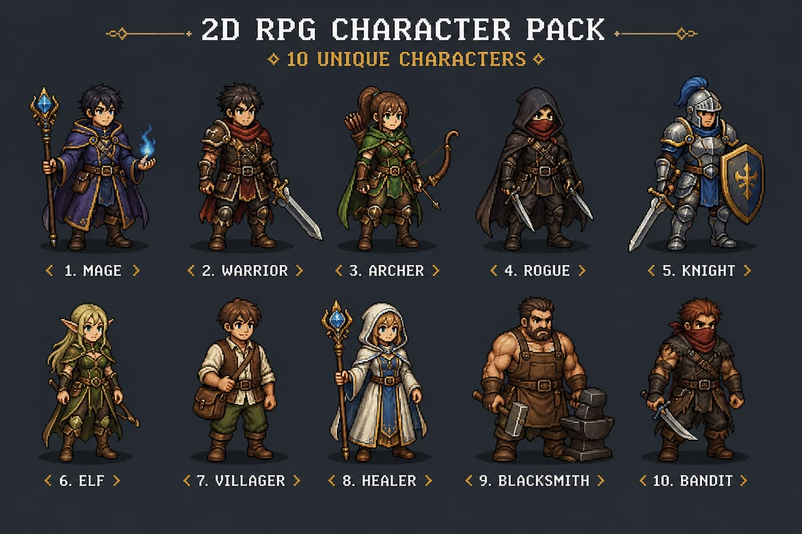
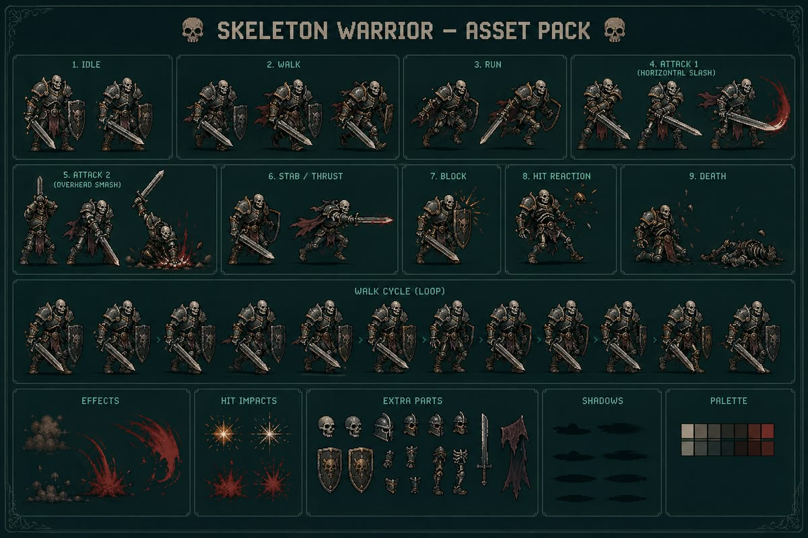
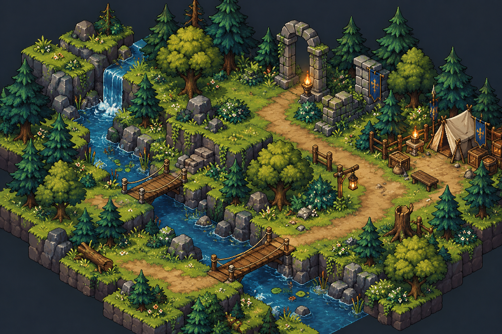

# Art Style References

Mood and style references for *Wreckbound*, provided by Gago on 2026-10-09.
These images are **references only**, not game assets: nothing here ships in the build.

## Images

### 1. Character lineup

Ten fantasy pixel-art characters (mage, warrior, archer, rogue, knight, elf, villager, healer,
blacksmith, bandit) in a 3/4 front view.

What we take from it:
- **Pixel art**, roughly 48–64 px tall characters with a dark 1 px outline and 3–4 shade ramps.
- Each class reads by **silhouette and one accent color**: purple mage, green archer, blue knight, white healer.
- Grounded, muted medieval palette (leather browns, steel greys) with saturated accents.
- Soft drop shadow under each unit, which we reuse on the battle grid.
- Maps directly onto our roles: Guard (knight), Fighter (warrior), Shooter (archer),
  Caster (mage), Support (healer); bandit = Reef Bandits enemy; villager and blacksmith = Camp NPCs.

### 2. Skeleton warrior animation sheet

A full animation set for one enemy: idle, walk, run, two attacks, stab, block, hit reaction,
death, a looping walk cycle, effects, hit impacts, extra parts, shadows and a palette.

What we take from it:
- The **animation list per unit** (see 12-art-audio.md): idle, attack (1–2 variants), hit, death
  are required; walk/run, block and stab are optional.
- Darker, desaturated palette for undead (Hollow Legion) with a **blood-red accent** for slashes.
- Separate **VFX sprites** (slash arcs, dust, hit sparks) layered on top of units; these become
  additive-blend particles in PixiJS.
- A **limited palette per character** (about 14 colors), which keeps the look consistent.

### 3. Isometric forest map

An isometric pixel-art diorama: cliffs, waterfall, river, rope bridges, dirt path, ancient stone
arch with torches, a camp with tents, banners and crates.

What we take from it:
- **Map presentation**: the island map as isometric diorama tiles on a dark background, with
  nodes placed along dirt paths (bridges and paths connect nodes).
- Biome look for **Whisperwood** (deep forest) and the **Camp** screen.
- Ruins (stone arch, torches, banners) as Ruin node landmarks.
- Raised tile edges with stone cliffs give depth while staying readable on a phone.

## Direction these references set

| Topic | Direction |
|---|---|
| Style | Detailed pixel art (candidate B in 12-art-audio.md) |
| Units | 3/4 front view, ~48–64 px source, scaled ×2–3 with nearest-neighbor |
| Map | Isometric pixel tiles; region maps built from a tileset |
| Palette | Muted medieval base, saturated role accents, dark UI backgrounds |
| Animation | Frame-by-frame sprites, plus AnimeJS for knockback, squash and UI juice |
| Rendering | PixiJS with `scaleMode: 'nearest'`, integer scaling, `roundPixels: true` |

## Licensing note

Before we use any real asset pack in this style, confirm its license allows use in our
project (CC0, CC BY with credit, or a purchased license). Credit authors on the Credits screen.
